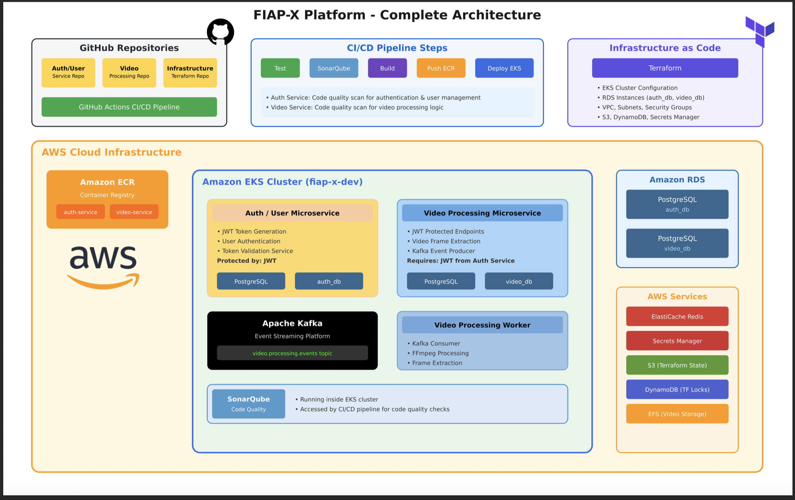

# FIAP-X Platform - Documentação de Arquitetura

## Visão Geral

A **FIAP-X Platform** é uma plataforma baseada em **microserviços com Clean Architecture**, desenvolvida em **Python 3.11 + FastAPI**, provisionada via **Terraform** e implantada em **AWS EKS**. Possui pipeline CI/CD automatizado com GitHub Actions para testes, análise de qualidade, build e deploy.

Repositorios:
Auth/User: https://github.com/kauan1020/Auth-Microservice
Processing: https://github.com/kauan1020/Processing-Microservice
Infra: https://github.com/kauan1020/Infra-Microservices
---

## Diagramas

1. **Diagrama de Alto Nível**
   - GitHub Repositories ➔ CI/CD ➔ ECR ➔ EKS ➔ RDS ➔ AWS Services

2. **Diagrama de Microserviços**
   - Auth Service ↔ JWT ↔ Video Processing Service
   - Video Processing Service ➔ Kafka ➔ Video Worker

3. **Diagrama de Infraestrutura**
   - VPC, Subnets, ALB, EKS, RDS, Redis, Secrets Manager, S3, EFS

---

## Arquitetura de Microserviços

### Auth Service

- **Função**: Autenticação e gerenciamento de usuários
- **Stack**: FastAPI, PostgreSQL, Redis, JWT

#### Endpoints

- `POST /auth/register`: Registro de usuários
- `POST /auth/login`: Login com geração de JWT
- `POST /auth/refresh`: Refresh de tokens
- `POST /auth/logout`: Logout
- `GET /auth/validate`: Validação de token

---

### User Management

- `GET /users/profile`: Consultar perfil
- `PUT /users/profile`: Atualizar perfil
- `POST /users/change-password`: Alterar senha

---

### Video Processing Service

- **Função**: Processamento e extração de frames de vídeos
- **Stack**: FastAPI, PostgreSQL, Redis, FFmpeg, Kafka

#### Endpoints

- `POST /video-processing/submit`: Submissão de vídeos
- `GET /video-processing/jobs`: Listagem de jobs
- `GET /video-processing/jobs/active`: Jobs ativos
- `GET /video-processing/jobs/{job_id}/status`: Status do processamento
- `GET /video-processing/jobs/{job_id}/progress`: Progresso detalhado
- `GET /video-processing/jobs/{job_id}/download`: Download de resultados
- `DELETE /video-processing/jobs/{job_id}`: Exclusão de job
- `GET /video-processing/jobs/{job_id}/frames`: Listagem de frames
- `POST /video-processing/jobs/{job_id}/cancel`: Cancelamento de job
- `GET /video-processing/system/health`: Health check
- `GET /video-processing/system/stats`: Estatísticas do sistema
- `GET /video-processing/user/preferences`: Preferências do usuário
- `PUT /video-processing/user/preferences`: Atualizar preferências

---

## Video Processing Worker

**Função**: Worker assíncrono para processar jobs de vídeo do Kafka ou via polling no banco.

- **Stack**: Python asyncio, FFmpeg, Kafka, PostgreSQL
- **Características**:
  - Consumo via Kafka Consumer Group ou fallback para polling
  - Paralelismo configurável (max_concurrent_jobs)
  - Health check loop com métricas:
    - Processed jobs
    - Failed jobs
    - Success rate
    - Kafka availability
  - Kafka recovery loop automático
  - Shutdown graceful com cleanup de tasks

---

## Infraestrutura AWS

| Serviço | Função |
|---|---|
| **EKS** | Kubernetes gerenciado |
| **RDS** | PostgreSQL por serviço |
| **Redis** | Cache de sessões |
| **S3** | Armazenamento de arquivos e estado Terraform |
| **ECR** | Container registry |
| **Secrets Manager** | Gerenciamento de secrets |
| **EFS** | Armazenamento compartilhado |

**Rede e Segurança**

- VPC com subnets públicas/privadas
- ALB como ingress controller
- Security Groups específicos

---

## Pipeline CI/CD

1. Testes unitários (pytest)
2. SonarQube para qualidade de código
3. Build de imagem Docker
4. Push para Amazon ECR
5. Deploy para EKS via kubectl
6. Smoke tests pós-deploy

---

## Padrões de Arquitetura

- **Clean Architecture**:

    (Use Cases ➔ Gateways ➔ Services ➔ Repositories ➔ Presenters)

---

## Observabilidade

- Health checks
- Logs centralizados
- Métricas de processamento e sucesso/falha de jobs
- Rastreamento completo de jobs assíncronos

---

## Tecnologias Principais

| Categoria | Stack |
|---|---|
| **Runtime** | Python 3.11, FastAPI |
| **Banco de Dados** | PostgreSQL 15, Redis 7 |
| **Mensageria** | Apache Kafka |
| **Processamento** | FFmpeg |
| **Orquestração** | Kubernetes (EKS) |
| **IaC** | Terraform |
| **CI/CD** | GitHub Actions |

---

## Testes

- Os testes estão localizados em `test/`

Frameworks utilizados: **pytest**, **pytest-asyncio**, **coverage**.

